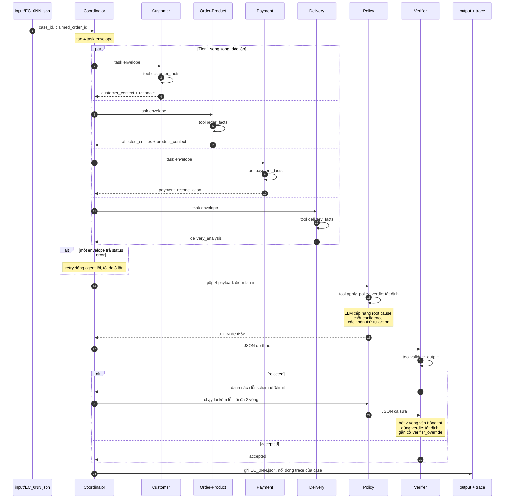

# Kiến trúc Multi-Agent — K4 Day 09

Hệ thống điều tra 50 case khiếu nại thương mại điện tử trên dữ liệu Olist bằng 7 agent, mỗi agent sở hữu một domain dữ liệu riêng và bàn giao kết quả qua message envelope chuẩn hóa (A2A).

- **Model:** `google/gemma-3-4b-it` (4B tham số, dưới ngưỡng 10B), provider OpenRouter
- **Policy:** `EC_POLICY_V2`
- **Orchestration:** runtime Python tự viết trong `src/agents/`, không dùng framework agent bên ngoài

## 1. Nguyên tắc thiết kế

### 1.1 Tách bạch "tính toán" và "phán đoán"

Toàn bộ con số xuất hiện trong output JSON (số tiền BRL, số giờ variance, timestamp, boolean `reconciled`) được tính bằng Python thuần trong [`src/facts.py`](src/facts.py) và [`src/policy.py`](src/policy.py). LLM **không bao giờ** tự sinh ra một con số để ghi vào file.

Lý do: 60% trọng số chấm điểm nằm ở các trường số học (delivery analysis, payment reconciliation, affected entities, evidence). Một model 4B thực hiện phép cộng float trên hàng chục dòng CSV sẽ sai lệch không kiểm soát được. Ngược lại, phần LLM đảm nhiệm là những việc nó làm tốt:

- Đọc fact bundle và quyết định thứ tự, cắt ngưỡng khi mảng vượt giới hạn
- Phát hiện mâu thuẫn giữa các nguồn dữ liệu và nêu cờ cảnh báo
- Diễn giải lý do phân loại, sinh `confidence`
- Kiểm tra chéo output của agent khác (Verifier)

### 1.2 Agent phải "sở hữu" dữ liệu, không chỉ mang tên

Mỗi agent chỉ được gọi đúng tool thuộc domain của mình. Agent Delivery không đọc được bảng payment; agent Payment không đọc được lịch sử khách hàng. Ràng buộc này ép các agent phải bàn giao thật sự thay vì mỗi agent tự lấy toàn bộ dữ liệu rồi tự kết luận.

### 1.3 Verifier có quyền bác bỏ

Verifier không phải bước ghi log cuối luồng. Nó là cổng chặn: khi phát hiện evidence ID sai định dạng, mảng vượt giới hạn, hoặc vi phạm quy tắc null, nó trả envelope `status = "rejected"` kèm danh sách lỗi, và Coordinator bắt buộc chạy lại Policy với phản hồi đó.

## 2. Sơ đồ agent

```text
                          input/EC_0NN.json
                                  |
                                  v
                    +-----------------------------+
                    |     COORDINATOR AGENT       |
                    |  intake -> dispatch -> merge|
                    +-----------------------------+
                                  |
        +---------------+---------+---------+---------------+
        |               |                   |               |
        v               v                   v               v
  +-----------+  +--------------+   +-------------+  +-------------+
  | CUSTOMER  |  |ORDER&PRODUCT |   |  PAYMENT    |  |  DELIVERY   |   TIER 1
  |  AGENT    |  |    AGENT     |   |   AGENT     |  |   AGENT     |   (song song,
  +-----------+  +--------------+   +-------------+  +-------------+    độc lập)
        |               |                   |               |
        +---------------+---------+---------+---------------+
                                  |
                        4 handoff envelope
                                  |
                                  v
                        +-------------------+
                        |   POLICY AGENT    |                            TIER 2
                        | EC_POLICY_V2      |                            (fan-in)
                        | taxonomy/refund   |
                        +-------------------+
                                  |
                                  v
                        +-------------------+
                        |  VERIFIER AGENT   |  --- rejected --+          TIER 3
                        | schema/ID/limit   |                 |          (cổng chặn)
                        +-------------------+                 |
                                  | accepted                  |
                                  v                           |
                    +-----------------------------+           |
                    |     COORDINATOR AGENT       | <---------+
                    |     assemble final JSON     |   retry (tối đa 2 lần)
                    +-----------------------------+
                                  |
                                  v
                        output/EC_0NN.json
                        logging/trace.jsonl
```

Tier 1 gồm 4 agent không phụ thuộc lẫn nhau nên được dispatch song song. Policy là điểm fan-in duy nhất: nó chỉ chạy khi đủ 4 envelope. Verifier là nút thắt cuối, có quyền đẩy ngược luồng.

## 3. Vai trò và quyền truy cập

Cột "Tool được phép" là ràng buộc cứng trong code: mỗi agent nhận một tool registry riêng, gọi tool ngoài danh sách sẽ bị runtime từ chối.

| Agent | Vai trò | Tool được phép | Bảng CSV chạm tới | Khối output sở hữu |
| --- | --- | --- | --- | --- |
| **Coordinator** | Nhận case, điều phối, gộp kết quả, xử lý retry | không có tool dữ liệu | không | khung JSON, `case_id` |
| **Customer** | Xác định danh tính khách và lịch sử mua hàng | `customer_facts` | `customers`, `orders` | `customer_context` |
| **Order & Product** | Kiểm kê order, item, seller, product, category | `order_facts` | `orders`, `order_items`, `products` | `affected_entities`, `product_context` |
| **Payment** | Tổng hợp payment row, đối soát với item + freight | `payment_facts` | `order_payments`, `order_items` | `payment_reconciliation` |
| **Delivery** | Tính delivery variance và seller handoff variance | `delivery_facts` | `orders`, `order_items` | `delivery_analysis` |
| **Policy** | Áp `EC_POLICY_V2`: taxonomy, trách nhiệm, refund, action | `apply_policy` | không đọc CSV trực tiếp | `case_assessment`, `root_cause_analysis`, `financial_resolution`, `resolution_actions`, `evidence_ids` |
| **Verifier** | Kiểm tra ID, null handling, giới hạn mảng, schema | `validate_output` | không đọc CSV trực tiếp | quyết định accept/reject |

Hai agent tầng sau (Policy, Verifier) cố tình bị cắt quyền đọc CSV. Chúng chỉ được suy luận trên bằng chứng do tier 1 bàn giao, nên không thể "tự bịa" một sự kiện không có trong handoff.

## 4. Luồng handoff (A2A)

### 4.1 Envelope chuẩn

Mọi trao đổi giữa agent dùng chung một cấu trúc:

```json
{
  "case_id": "EC_001",
  "task_id": "EC_001::delivery",
  "from_agent": "delivery",
  "to_agent": "policy",
  "status": "ok",
  "payload": {
    "delivered_at": "2018-03-31 15:23:33",
    "delivery_variance_hours": 87.39,
    "late_handoff_seller_ids": ["<seller_id>"]
  },
  "tool_calls": ["delivery_facts"],
  "rationale": "Giao sau hạn dự kiến 87.39 giờ; 1 seller bàn giao trễ so với shipping_limit_date.",
  "flags": [],
  "latency_ms": 1310,
  "tokens": { "prompt": 812, "completion": 143 }
}
```

- `payload`: dữ liệu số do tool sinh, agent không được sửa
- `rationale`: phần LLM sinh ra, dùng cho trace và cho Policy đọc
- `flags`: cảnh báo agent tự phát hiện (ví dụ `no_item_rows`, `payment_mismatch`)
- `status`: `ok` | `error` | `rejected`

### 4.2 Trình tự một case

1. **Coordinator** đọc `input/EC_0NN.json`, lấy `claimed_order_id`, tạo 4 task envelope.
2. **Tier 1** chạy song song. Mỗi agent gọi tool của mình, đọc fact bundle, sinh `rationale` và `flags`, trả envelope.
3. **Coordinator** gom 4 envelope. Nếu có `status = "error"`, retry riêng agent đó.
4. **Policy** nhận 4 payload đã gộp, gọi `apply_policy` để lấy verdict tất định, sau đó LLM: xếp hạng root cause, chốt `confidence`, xác nhận thứ tự action, giải thích tại sao nhánh này thắng trong thang ưu tiên.
5. **Verifier** nhận JSON dự thảo, chạy `validate_output` (kiểm tra tất định) rồi LLM soát lại các điểm mà rule khó bắt: evidence có khớp entity thật không, `case_status` có nhất quán với refund không.
6. Nếu `rejected`, Coordinator gửi lại Policy kèm danh sách lỗi, tối đa 2 vòng. Nếu vẫn hỏng, ghi output từ verdict tất định và đánh `flags` vào trace.
7. **Coordinator** ghi `output/EC_0NN.json` và nối các bước của case vào `logging/trace.jsonl` của lượt chạy hiện tại.

> `logging/trace.jsonl` được truncate một lần duy nhất ở đầu mỗi lượt chạy (bước 0 của `src/run.py`), sau đó 50 case lần lượt nối dòng vào cùng file đó. File cuối cùng vì vậy luôn chỉ chứa đúng lượt chạy mới nhất, đúng yêu cầu "không append" của đề.

Biểu diễn theo trục thời gian, khối `par` là đoạn chạy song song, khối `alt` là nhánh rẽ:



Ba mốc đồng bộ quan trọng trong sơ đồ:

| Mốc | Ý nghĩa |
| --- | --- |
| Cuối khối `par` | Rào chắn: Policy chỉ khởi động khi đủ 4 envelope. Thời gian tier 1 bằng agent chậm nhất, không phải tổng 4 agent |
| `CO->>PO` | Điểm fan-in duy nhất, nơi dữ liệu 4 domain gặp nhau lần đầu |
| Khối `alt rejected` | Vòng phản hồi ngược duy nhất; mọi nhánh thoát đều ghi ra file output hợp lệ |

### 4.3 Quy tắc kiểm chứng của Verifier

| Nhóm kiểm tra | Nội dung |
| --- | --- |
| Định dạng ID | `order:`, `item:<order_id>:<n>`, `payment:<order_id>:<n>`, `seller:`, `policy:` đúng mẫu |
| Tồn tại thật | mọi ID phải dựng được từ CSV, không có ID lạ |
| Giới hạn mảng | 5 order / 5 item / 3 seller / 5 payment / 5 related / 5 product / 5 category / 3 cause / 3 party / 20 evidence / 5 action |
| Quy tắc null | order không có item row: `expected_total_brl`, `difference_brl`, `reconciled` phải `null`; item/seller/product/category/handoff là mảng rỗng |
| Nhất quán | `case_status = action_required` khi và chỉ khi `recommended_refund_brl > 0` |
| Thứ tự | secondary issues và resolution actions đúng thứ tự nghiệp vụ |
| Schema | đủ khóa, đúng kiểu, `confidence` trong `[0, 1]`, timestamp đúng `YYYY-MM-DD HH:MM:SS` hoặc `null` |

## 5. Tầng dữ liệu tất định

```text
data/*.csv  ->  src/data_store.py   (load 1 lần, dựng index theo order_id,
                                     customer_id, customer_unique_id)
                        |
                        v
                src/facts.py        (order_facts, customer_facts,
                                     delivery_facts, payment_facts)
                        |
                        v
                src/policy.py       (thang ưu tiên EC_POLICY_V2, refund,
                                     thứ tự action, dựng evidence ID)
```

Công thức áp dụng, làm tròn 2 chữ số thập phân:

```text
delivery_variance_hours = order_delivered_customer_date - order_estimated_delivery_date
handoff_variance_hours  = order_delivered_carrier_date - min(shipping_limit_date) theo seller
expected_total_brl      = sum(price) + sum(freight_value)
difference_brl          = sum(payment_value) - expected_total_brl
reconciled              = abs(difference_brl) <= 0.10
```

Thang ưu tiên primary issue, xét từ trên xuống, khớp đầu tiên thì dừng:

1. `canceled_order_paid` — status `canceled` và tổng payment > 0
2. `unavailable_order_paid` — status `unavailable` và tổng payment > 0
3. `late_delivery_seller` — giao trễ và có ít nhất 1 seller bàn giao sau `shipping_limit_date`
4. `late_delivery_logistics` — giao trễ và không seller nào trễ
5. `valid_split_payment` — từ 2 payment row và đối soát khớp trong 0.10 BRL
6. `unsupported_late_claim` — còn lại

## 6. Trace

`logging/trace.jsonl` mở ở chế độ ghi đè (`mode="w"`) một lần ở đầu mỗi lượt chạy, không bao giờ mở ở chế độ `mode="a"`. Trace của lượt trước bị xóa sạch, nên file luôn phản ánh đúng một lượt chạy 50 case mới nhất.

Trong phạm vi một lượt chạy, mỗi bước agent nối thêm một dòng JSON:

```json
{
  "ts": "2026-08-05T14:32:11.204Z",
  "case_id": "EC_001",
  "agent": "policy",
  "tier": 2,
  "inputs_from": ["customer", "order_product", "payment", "delivery"],
  "tool_calls": ["apply_policy"],
  "status": "ok",
  "latency_ms": 1487,
  "tokens": { "prompt": 1204, "completion": 218 },
  "model": "google/gemma-3-4b-it"
}
```

Trace cho phép dựng lại đúng thứ tự dispatch, số vòng retry và chi phí token của từng case.

## 7. Xử lý lỗi

| Tình huống | Cách xử lý |
| --- | --- |
| Order không có item row (6 case) | `expected/difference/reconciled = null`, các mảng liên quan rỗng; Payment agent gắn flag `no_item_rows` |
| LLM trả JSON kèm code fence | parser bóc ```` ```json ```` trước khi `json.loads` |
| LLM trả JSON hỏng | retry tối đa 3 lần; hết lượt thì dùng verdict tất định, ghi flag vào trace |
| Lỗi mạng / rate limit | backoff lũy thừa, tối đa 3 lần thử |
| Verifier reject 2 vòng liên tiếp | ghi output tất định, đánh dấu `verifier_override` trong trace |

Trong mọi nhánh lỗi, hệ thống vẫn ghi ra file output hợp lệ về schema — không case nào bị bỏ trống.

## 8. Trạng thái hiện tại

### 8.1 Thành phần

| Thành phần | File | Trạng thái |
| --- | --- | --- |
| Data store | `src/data_store.py` | Hoàn thành |
| Fact tools | `src/facts.py` | Hoàn thành |
| Policy engine | `src/policy.py` | Hoàn thành, đối chiếu tất định trên 50 case |
| Config | `src/config.py` | Hoàn thành |
| LLM client | `src/llm.py` | Hoàn thành — backoff 3 lần, bóc code fence, fallback khi JSON hỏng |
| Verifier tool | `src/validate.py` | Hoàn thành — 7 nhóm kiểm tra theo mục 4.3 |
| Trace writer | `src/trace.py` | Hoàn thành — `mode="w"`, lock cho tier 1 song song |
| Agent runtime | `src/agents/` | Hoàn thành — 7 agent, envelope A2A, tool registry đóng |
| Entry point | `src/run.py` | Hoàn thành — `--limit`, `--case`, `--workers` |
| Metadata | `logging/metadata.json` | Hoàn thành |
| Output 50 case | `output/` | Hoàn thành — 50/50 case |
| Kiểm tra bài nộp | `tools/check_submission.py` | Hoàn thành — 3 tầng kiểm tra, đóng zip |
| Tái dựng tất định | `tools/regen.py` | Hoàn thành — dựng lại 50 case không gọi LLM |

### 8.2 Kết quả kiểm chứng đã thực hiện

```bash
python -m src.run
python -m tools.check_submission
```

- 50/50 case ghi ra output hợp lệ, `validate_output` trả về 0 lỗi
- `primary_issue`, `recommended_refund_brl`, `resolution_actions`, `evidence_ids` trùng khớp tuyệt đối với verdict tất định của `src/policy.py` — tức LLM không làm lệch trường được chấm điểm
- `confidence` biến thiên 0.30–0.95 (trung bình 0.86), xác nhận Policy Agent thực sự suy luận thay vì trả hằng số
- Trace ghi đúng 400 dòng: 8 dòng mỗi case gồm 1 dispatch, 4 tier 1, 1 policy, 1 verifier, 1 written
- 34 case `action_required`, 16 case `no_action`, tổng refund đề xuất 3437.76 BRL

Tính tái lập: hai lượt chạy độc lập cho ra 48/50 file trùng nhau **từng byte**. Hai file lệch duy nhất chỉ khác trường `confidence` — trường duy nhất do LLM sinh. Toàn bộ phần tất định tái lập chính xác 100%.

Chạy song song: các case độc lập nhau nên `src/run.py` dispatch chúng qua `ThreadPoolExecutor` với `MAX_CASE_WORKERS = 8`, và `src/llm.py` xoay vòng qua mọi key `OPENROUTER_API_KEY*` để phân tán rate limit. Đo thực tế trên 8 case: 42.2 giây so với khoảng 240 giây khi chạy tuần tự, nhanh hơn 5.7 lần. Mỗi case gom bản ghi trace vào buffer rồi ghi một khối qua `TraceWriter.write_block()`, nên dù chạy song song, các dòng của một case vẫn liền mạch và đúng thứ tự.

Đối chiếu tất định trên toàn bộ 50 case cho phân bố phủ đủ 6 nhánh của thang ưu tiên:

| Primary issue | Số case |
| --- | ---: |
| `late_delivery_seller` | 10 |
| `late_delivery_logistics` | 10 |
| `canceled_order_paid` | 8 |
| `valid_split_payment` | 8 |
| `unsupported_late_claim` | 8 |
| `unavailable_order_paid` | 6 |

6 case `unavailable` không có item row, đi đúng nhánh null handling.

### 8.3 Điểm còn mở

Các quy ước dưới đây đề không quy định; cách hiểu đang dùng được khai báo tường minh trong mã nguồn thay vì giấu trong logic.

- **Điều kiện kích hoạt action bổ sung.** Đề chỉ quy định thứ tự của `review_seller_handoff`, `verify_refund_completion`, `coordinate_multi_seller_case`, `verify_payment_allocation`, không quy định khi nào thêm chúng. Cách hiểu đang dùng nằm ở `src/policy.py::resolution_actions`.
- **Ba quy ước delivery**, khai báo ở `src/config.py`:

  | Cờ | Giá trị đang dùng | Lựa chọn khác | Case bị ảnh hưởng |
  | --- | --- | --- | ---: |
  | `EARLY_DELIVERY_VARIANCE` | `signed` — giao sớm báo số âm | `null`, `zero` | 16 |
  | `HANDOFF_GRANULARITY` | `seller` — gộp theo seller, lấy `shipping_limit_date` sớm nhất | `item` — một dòng mỗi item row | 26 |
  | `LATE_HANDOFF_THRESHOLD` | `gt` | `gte` | 0 |

  `LATE_HANDOFF_THRESHOLD` không có tác dụng thực tế: không case nào có `handoff_variance_hours` đúng bằng 0.

  Ví dụ trong đề khớp cách tính hiện tại từng chữ số, nhưng order đó chỉ có một item row nên không phân biệt được `seller` với `item`. 26/44 case có item row cho kết quả khác nhau giữa hai cách, và đề không nói rõ chọn cách nào.

Bài nộp giữ nguyên cách tính bám sát công thức ghi trong đề.
